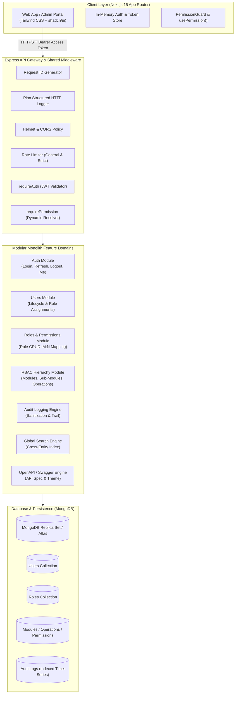
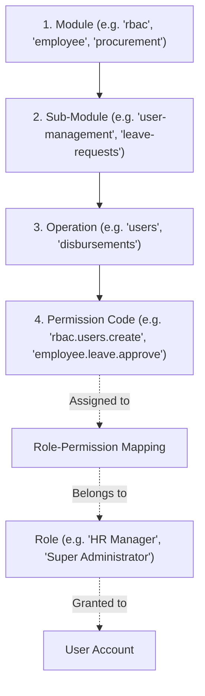
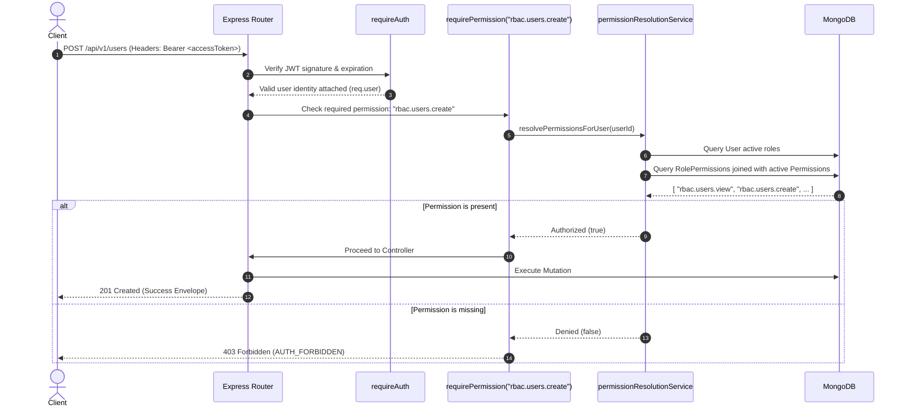
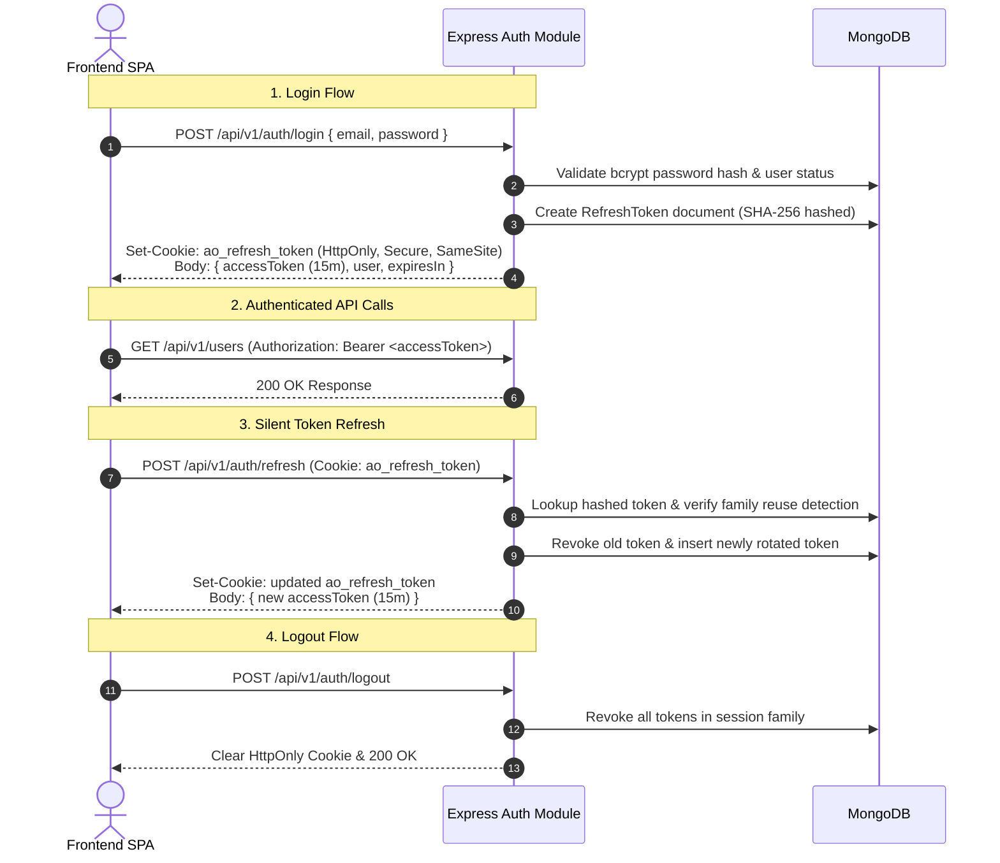
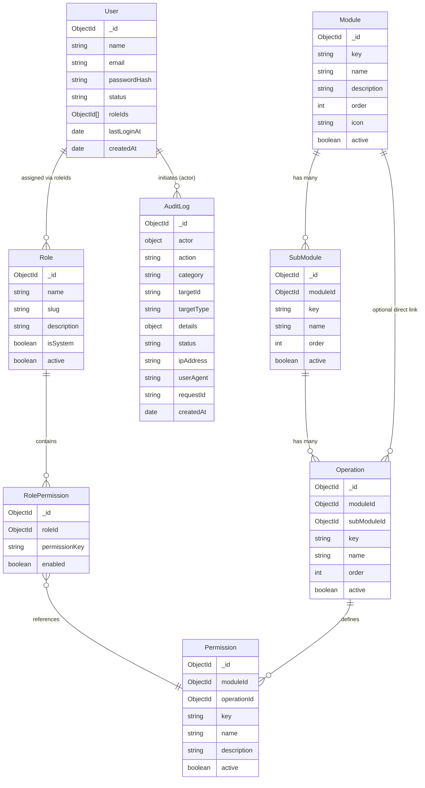

# AccessOrbit — System Architecture & Technical Blueprint

**AccessOrbit** is an enterprise-grade access control and identity governance platform powered by a fully dynamic, runtime-evaluated Role-Based Access Control (RBAC) engine.

---

## 1. High-Level Architecture Overview

AccessOrbit is designed as a **Modular Monolith** with a decoupled **Next.js Single-Page Application (SPA)** frontend and a high-throughput **Node.js/Express TypeScript** backend API backed by **MongoDB**.



---

## 2. Dynamic RBAC Engine Design

### 2.1 The 4-Tier RBAC Hierarchy

AccessOrbit decouples authorization logic into a hierarchical four-tier governance model:



1. **Module**: Top-level application boundary or business domain.
2. **Sub-Module**: Logical functional subgrouping inside a parent module.
3. **Operation**: An action set or functional capability (e.g., `view`, `create`, `update`, `delete`, `approve`).
4. **Permission**: The atomic code string (e.g., `rbac.users.create`, `employee.leave.approve`) tested by authorization middleware.

### 2.2 Runtime Permission Resolution (Zero-Code Governance)

Unlike legacy systems that embed static roles or permissions inside JWT claims, AccessOrbit resolves effective permissions **dynamically from MongoDB on every request**.



#### Why This Design Matters:
- **Instant Role Revocation**: Revoking a permission or suspending a user takes effect on the very next HTTP request without forcing the user to log out or re-authenticate.
- **Stateless Tokens**: JWT access tokens remain lean (containing only `sub`, `type`, and `jti`), eliminating token bloat and stale permission claims.
- **Future Caching Seam**: The `permissionResolutionService` acts as a single isolation boundary where Redis caching with cache invalidation hooks can be enabled seamlessly.

---

## 3. Authentication & Session Lifecycle

AccessOrbit implements an enterprise dual-token authentication pattern with rotating refresh tokens:



### Security Safeguards:
- **In-Memory Access Tokens**: The frontend never stores access tokens in `localStorage` or `sessionStorage` (preventing XSS exfiltration).
- **Single-Flight Token Refresh**: When concurrent API requests encounter an expired access token, a single-flight mutex ensures only one refresh request is sent to the backend; all pending calls wait and replay once refreshed.
- **Token Reuse Detection**: If an already-rotated refresh token is re-submitted, AccessOrbit detects the replay attack and revokes the entire token family immediately.

---

## 4. Backend Modular Monolith Structure

The backend follows clean layered architecture principles within each domain module:

```
src/modules/<feature>/
├── <feature>.routes.ts       # Route declarations, route-level rate limiting, and permission gates
├── <feature>.validators.ts   # Zod request body, query parameter, and path param schemas
├── <feature>.controller.ts   # Request/response adaptation, HTTP status mapping, audit triggers
├── <feature>.service.ts      # Core business logic, transactional workflows, validations
└── <feature>.repository.ts   # Mongoose database queries, projection, and pagination
```

### Shared Infrastructure Base (`src/shared/`)
- **`middleware/`**: `request-id`, `http-logger`, `validate` (Zod), `rate-limit`, `error-handler`, `not-found`.
- **`errors/`**: Standard error hierarchy (`AppError`, `UnauthorizedError`, `ForbiddenError`, `NotFoundError`, `ConflictError`, `ValidationError`).
- **`utils/response.ts`**: Standardized JSON envelopes:
  - Success: `{ "success": true, "message": "...", "data": {...}, "requestId": "..." }`
  - Error: `{ "success": false, "message": "...", "error": { "code": "...", "details": [...] }, "requestId": "..." }`

---

## 5. Frontend Architecture & Client Security

### 5.1 Directory Structure & Organization

```
src/
├── app/                      # Next.js App Router root layout & route pages
│   ├── (admin)/              # Protected admin routes (/users, /roles, /modules, /permissions, /audit-logs)
│   ├── (auth)/               # Public authentication routes (/login)
│   └── dashboard/            # System overview & RBAC health dashboard
├── features/                 # Modular feature slices
│   ├── auth/                 # Login forms, authentication hooks
│   ├── dashboard/            # Overview widgets, stat cards, hierarchy flow
│   ├── users/                # User table, creation/edit modals, role assignment
│   ├── roles/                # Roles table, dynamic permission assignment matrix
│   ├── modules/              # 3-tab manager for Modules, Sub-Modules, Operations
│   ├── permissions/          # Permission codes data table & modal forms
│   └── audit-logs/           # Audit trail log table & JSON detail inspector
├── components/               # Reusable UI components & shadcn primitives
│   ├── layout/               # DashboardShell, Sidebar, Header, Breadcrumbs
│   └── ui/                   # Buttons, Tables, Dialogs, Sonner Toaster, SearchDialog
├── hooks/                    # usePermission, useSession, usePermissionError
├── services/                 # Strongly typed Axios/Fetch API clients
└── lib/                      # Client-side helpers, token store, and query utilities
```

### 5.2 Client-Side Permission Gating

The client hydrates effective permissions from `GET /api/v1/auth/me` on boot:

```tsx
// Example of declarative component-level permission guard
<PermissionGuard permission="rbac.users.create" fallback={<Button disabled>Create</Button>}>
  <CreateUserButton onClick={openModal} />
</PermissionGuard>
```

- **`usePermission()` Hook**: Exposes `hasPermission(key)`, `hasAnyPermission([keys])`, and `hasAllPermissions([keys])`.
- **Self-Healing Session**: When an API call returns `403 AUTH_FORBIDDEN` (because a permission was revoked mid-session), `usePermissionError()` catches the error, refreshes the session in the background, and seamlessly adapts the UI.

---

## 6. Database Entity-Relationship Diagram



---

## 7. Audit Logging Architecture

Every security-sensitive event (authentication, role modifications, user creation/suspension, permission adjustments) is logged to the `AuditLog` collection:

1. **Non-Blocking Execution**: Auditing runs asynchronously without delaying the client's HTTP response.
2. **Recursive Data Sanitization**: Sensitive keys (such as `password`, `token`, `secret`, `authorization`, `cookie`) are recursively masked as `[REDACTED]` before saving.
3. **Structured Context**: Captures actor ID, IP address, user-agent string, request ID, status (`success` or `failure`), and target resource metadata.

---

## 8. Quality Assurance & Testing Strategy

AccessOrbit enforces comprehensive multi-tiered testing:

- **Unit & Service Tests**: Validates business logic, password hashing, token generation, and validator rules in isolation.
- **Integration Tests**: Tests full HTTP route flows against a dedicated MongoDB test database using Supertest.
- **Frontend Component Tests**: Verifies UI component rendering, modal workflows, dynamic forms, and permission gating using Vitest and React Testing Library.

```bash
# Run backend test suite (17 suites, 170+ tests)
npm test

# Run frontend test suite (9 suites, 59+ tests)
npm test -w frontend
```
